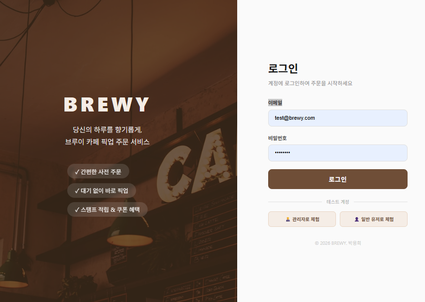
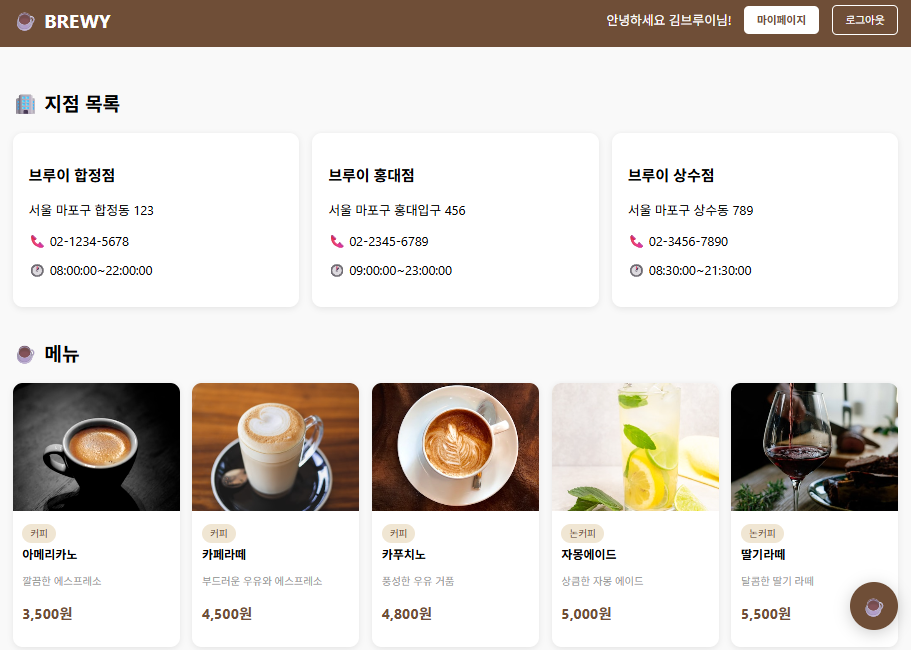
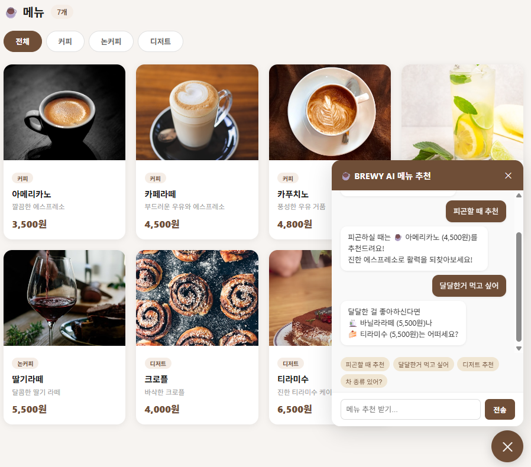
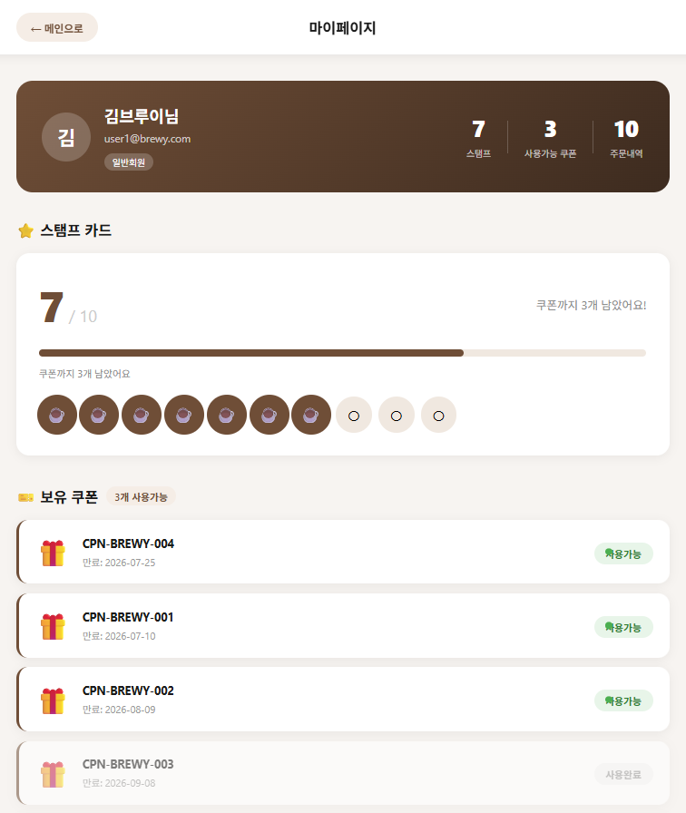
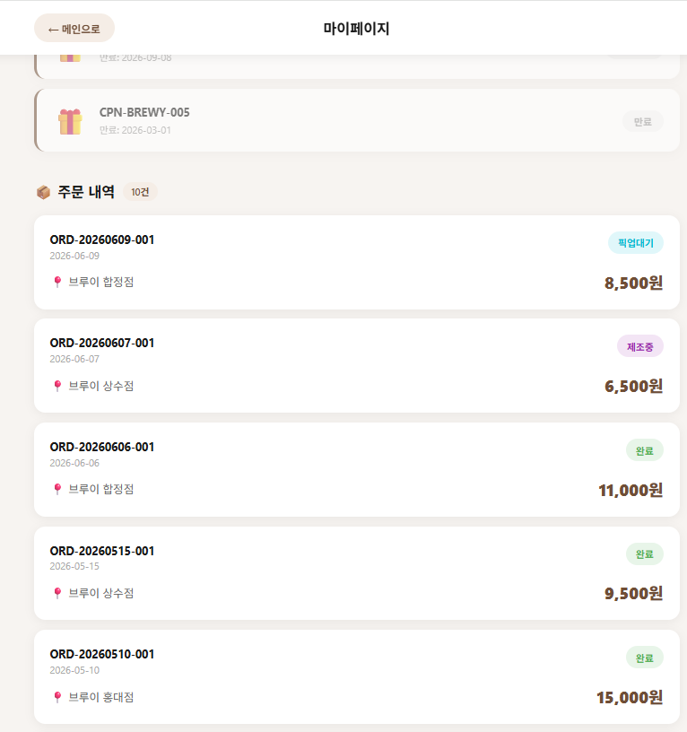
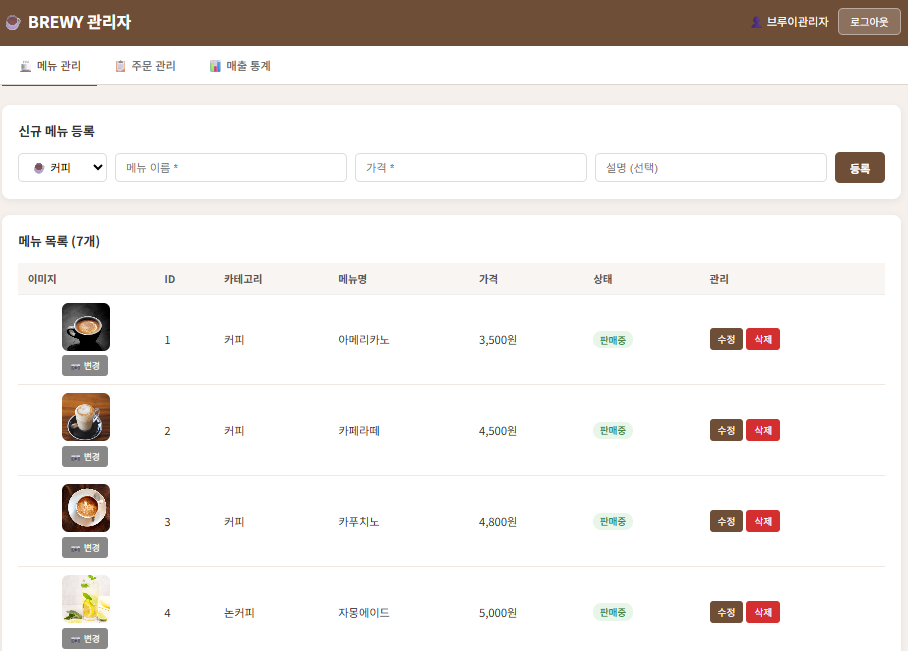
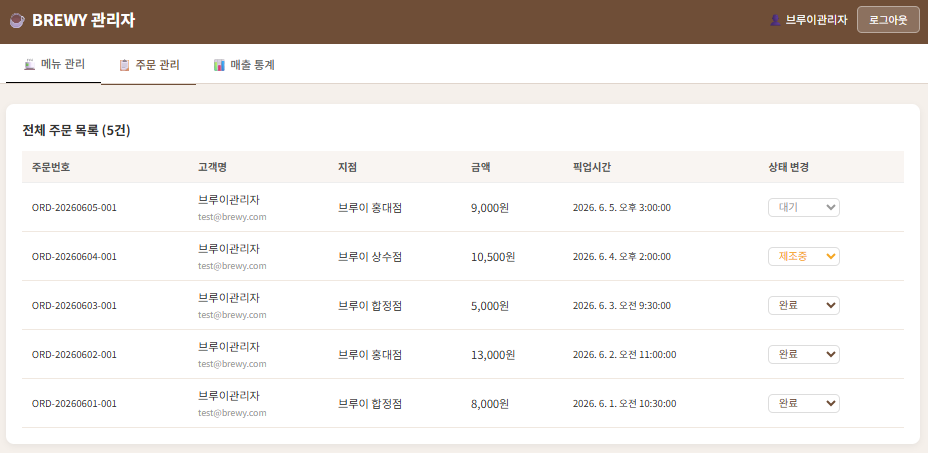
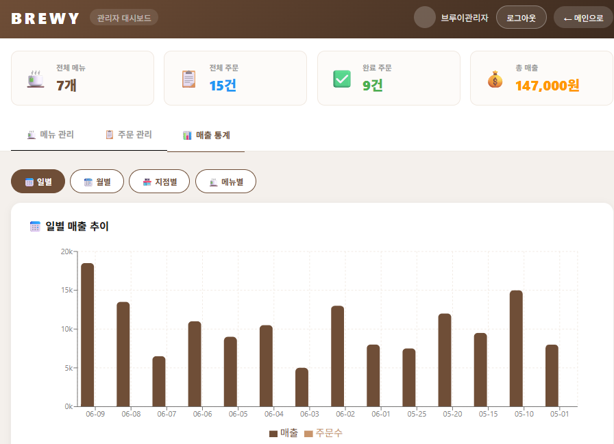
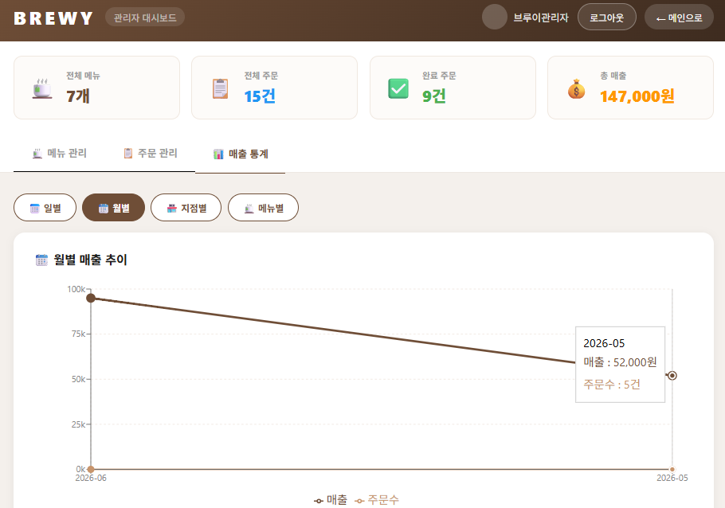
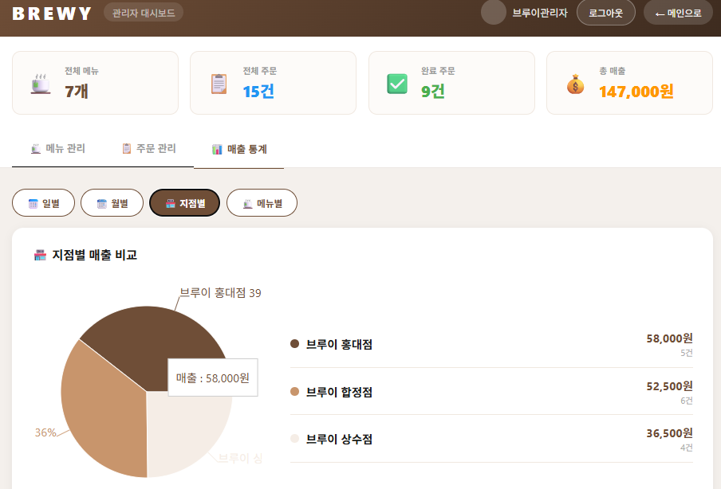

# ☕ BREWY (브루이 카페 픽업 주문)

> 개발 컨설턴트 포트폴리오를 위한 Node.js 백엔드 + React 프론트엔드 프로젝트
> AI 바이브코딩 실습을 병행하며 실무형 API 설계를 학습하는 저장소입니다.

---

## 📸 화면 미리보기

---

### 👤 일반 유저 화면

#### 🔐 로그인


#### 🏠 메인 화면 (지점 + 메뉴 이미지 카드)


#### 🤖 AI 메뉴 추천 챗봇


#### 👤 마이페이지 1 — 프로필 + 스탬프 카드 (7/10 적립)


#### 👤 마이페이지 2 — 쿠폰 + 주문 내역


---

### 👨‍💼 관리자 화면

#### 🍵 메뉴 관리 (등록 / 수정 / 이미지 업로드 / 비활성화)


#### 📋 주문 관리 (전체 주문 목록 + 상태 변경)


#### 📊 매출 통계 1 — 일별 막대그래프


#### 📊 매출 통계 2 — 월별 라인그래프


#### 📊 매출 통계 3 — 지점별 파이차트


---

## 👨‍💻 프로젝트 개요
- **프로젝트명**: BREWY (브루이 카페 픽업 주문)
- **개발자**: 박용희
- **개발 목적**
  - 개발 컨설턴트 포트폴리오
  - Node.js 백엔드 + React 프론트엔드 학습
  - AI 바이브코딩 실습

---

## 🛠 기술 스택

### Backend
- Node.js v20 + Express
- MySQL 9.7
- JWT 인증 + bcrypt 암호화
- dotenv, cors
- multer (이미지 업로드)
- morgan (HTTP 요청 로깅)
- express-rate-limit (요청 횟수 제한 / 보안)
- PM2 (프로세스 관리 / 운영 배포용)

### Frontend
- React.js
- React Router DOM
- Axios
- Recharts (차트 라이브러리)

### AI/분석
- Python 3.13
- pandas, mysql-connector-python
- OpenAI API (챗봇)

### 인프라 준비
- ecosystem.config.js (PM2 설정)
- .env.production.example (운영 환경 변수 양식)
- logs/ (서버 로그 저장 폴더)

---

## 🚀 개발 진행 단계

### ✅ Phase 1. 환경 세팅
- Node.js, MySQL 설치
- `brewy` DB + 테이블 6개 생성
- 샘플 데이터 입력

### ✅ Phase 2. 기본 API 개발
- 회원가입/로그인 (JWT)
- 내정보 조회 (JWT 인증)
- 지점/메뉴 목록 조회
- Postman 테스트 완료

### ✅ Phase 3. 에러 테스트 완료
- 의도적 에러 발생
- AI 활용 디버깅

### ✅ Phase 4. 주문 API 완료
- 주문 생성 (트랜잭션)
- 주문 조회/취소
- 동적 쿼리 필터링 (status/날짜)

### ✅ Phase 5. Python 데이터 분석 완료
- Python 3.13 환경 구축
- mysql-connector-python 연동
- pandas DataFrame 활용
- BREWY DB 통계 분석
  - 전체 주문 수
  - 지점별 매출
  - 인기 메뉴 TOP 5
  - 카테고리별 매출
  - 일별 주문 현황

### ✅ Phase 6. 스탬프/쿠폰 시스템 완료
- stamps/coupons 테이블 설계/생성
- 스탬프 적립/조회 API
- 쿠폰 목록/사용 API
- 주문 완료 시 자동 스탬프 적립
- 스탬프 10개 달성 시 쿠폰 자동 발급

### ✅ Phase 7. React 프론트엔드 완료
- 로그인 화면
- 메인 화면 (지점/메뉴 목록)
- 마이페이지 (스탬프/쿠폰/주문내역)
- AI 메뉴 추천 챗봇 (우측 하단 버튼)

### ✅ Phase 8. 매출 통계 API 완료
- 일별/월별 매출 통계
- 지점별 매출 비교
- 관리자 전용 API (adminOnly 미들웨어)
- users 테이블 role 컬럼 추가

### ✅ Phase 10. 관리자 API 완료
- 메뉴 등록 / 수정 / 비활성화(soft delete)
- 전체 주문 목록 조회
- 주문 상태 변경 (pending→paid→making→ready→done)

### ✅ Phase 11. 관리자 대시보드 React UI 완료
- 관리자/일반유저 role 기반 라우팅 분리
  - admin → `/admin` 자동 이동
  - user → `/main` 자동 이동
- 3탭 구성: 메뉴 관리 / 주문 관리 / 매출 통계
- 메뉴 등록·수정·삭제 UI
- 주문 상태 드롭다운 변경 UI
- 일별·월별·지점별·메뉴별 통계 테이블

### ✅ Phase 12. 메뉴 이미지 업로드 완료
- multer 미들웨어로 서버 디스크 저장
- `POST /api/admin/products/:id/image` 엔드포인트
- 기존 이미지 자동 삭제 (디스크 낭비 방지)
- 관리자 페이지: 썸네일 + 📷변경 버튼
- 메인 페이지: 메뉴 카드 이미지 표시

### ✅ Phase 13. UI 전면 리디자인 + 차트 완료
- 로그인 페이지: 좌우 분할 레이아웃 + 카페 배경 이미지
- 메인 페이지: 히어로 배너 + 카테고리 필터 탭 + 호버 효과
- 마이페이지: 프로필 아바타 + 스탬프 프로그레스바 + 티켓형 쿠폰
- 관리자 페이지: 요약 카드 4개 + 테이블 줄 색상 개선
- Recharts 차트 추가
  - 일별 매출: 막대그래프
  - 월별 매출: 라인그래프
  - 지점별 매출: 파이차트
  - 메뉴별 판매: 가로 막대그래프

### ✅ Phase 14. 보안 미들웨어 + AWS 배포 준비 완료
- Morgan: HTTP 요청 자동 로깅 (개발/운영 모드 분리)
- Rate Limiting: 전체 API 15분/200회, 로그인 15분/10회 제한
- PM2 설치 + ecosystem.config.js 작성
- .env.production.example 작성
- logs/ 폴더 생성

### ✅ Phase 15. AWS EC2 배포 완료
- AWS EC2 t3.micro (서울 리전 ap-northeast-2)
- Ubuntu 26.04 LTS 서버 세팅
- Node.js 20 (NVM) + MySQL 8.4 + Nginx 1.28 설치
- PM2로 백엔드 상시 실행 (ecosystem.config.js)
- React 프로덕션 빌드 + Nginx 정적 파일 서빙
- Nginx 리버스 프록시 (/api → Node.js 8080)
- AWS 보안 그룹 포트 설정 (22/80/443)
- **실제 서비스 URL: http://13.125.180.146**

### 🔜 Phase 16. 카카오 소셜 로그인 (예정)

### 🔜 Phase 17. 도메인 + HTTPS 설정 (예정)

### 🔜 Phase 18. Jest 단위 테스트 (예정)

### 🔜 Phase 19. Docker 컨테이너화 (예정)

---

## 📡 API 목록

### 인증
| Method | Endpoint | 설명 |
|--------|----------|------|
| POST | /api/auth/register | 회원가입 |
| POST | /api/auth/login | 로그인 JWT 발급 |

### 회원
| Method | Endpoint | 설명 | 인증 |
|--------|----------|------|------|
| GET | /api/users/me | 내정보 조회 | ✅ |

### 지점/메뉴
| Method | Endpoint | 설명 |
|--------|----------|------|
| GET | /api/branches | 지점 목록 |
| GET | /api/products | 메뉴 목록 |
| GET | /api/products/:id | 메뉴 상세 |

### 주문
| Method | Endpoint | 설명 | 인증 |
|--------|----------|------|------|
| POST | /api/orders | 주문 생성 | ✅ |
| GET | /api/orders | 주문 목록 (필터) | ✅ |
| GET | /api/orders/:id | 주문 상세 | ✅ |
| PATCH | /api/orders/:id/cancel | 주문 취소 | ✅ |

### 스탬프
| Method | Endpoint | 설명 | 인증 |
|--------|----------|------|------|
| GET | /api/stamps | 스탬프 목록 | ✅ |
| GET | /api/stamps/count | 스탬프 개수 | ✅ |

### 쿠폰
| Method | Endpoint | 설명 | 인증 |
|--------|----------|------|------|
| GET | /api/coupons | 쿠폰 목록 | ✅ |
| POST | /api/coupons/use | 쿠폰 사용 | ✅ |

### 관리자 (admin 전용 🔒)
| Method | Endpoint | 설명 | 인증 |
|--------|----------|------|------|
| GET | /api/admin/stats/daily | 일별 매출 통계 | ✅ admin |
| GET | /api/admin/stats/monthly | 월별 매출 통계 | ✅ admin |
| GET | /api/admin/stats/branch | 지점별 매출 통계 | ✅ admin |
| GET | /api/admin/stats/menu | 메뉴별 매출 통계 | ✅ admin |
| GET | /api/admin/products | 메뉴 전체 목록 | ✅ admin |
| POST | /api/admin/products | 메뉴 등록 | ✅ admin |
| PUT | /api/admin/products/:id | 메뉴 수정 | ✅ admin |
| DELETE | /api/admin/products/:id | 메뉴 비활성화 | ✅ admin |
| POST | /api/admin/products/:id/image | 메뉴 이미지 업로드 | ✅ admin |
| GET | /api/admin/orders | 전체 주문 목록 | ✅ admin |
| PATCH | /api/admin/orders/:id/status | 주문 상태 변경 | ✅ admin |

---

## 👤 테스트 계정

| 역할 | 이메일 | 비밀번호 | 이동 경로 |
|------|--------|---------|----------|
| 관리자 | test@brewy.com | 12341234 | `/admin` |
| 일반유저 | user1@brewy.com | 12341234 | `/main` |

---

## 📁 폴더 구조

```bash
brewy-fullstack/
├── app.js                      # 서버 시작점, 미들웨어/라우터 등록
├── .env                        # 환경변수 (GitHub 미포함 - 직접 생성!)
├── config/
│   └── db.js                   # MySQL 커넥션 풀
├── routes/
│   ├── auth.js
│   ├── users.js
│   ├── branches.js
│   ├── products.js
│   ├── orders.js
│   ├── stamps.js
│   ├── coupons.js
│   └── admin.js                # 관리자 전용 라우터
├── controllers/
│   ├── authController.js
│   ├── userController.js
│   ├── branchController.js
│   ├── productController.js
│   ├── orderController.js
│   ├── stampController.js
│   ├── couponController.js
│   └── adminController.js      # 관리자 API (통계/메뉴/주문 관리)
├── models/
│   ├── User.js
│   ├── Branch.js
│   ├── Product.js
│   ├── Order.js
│   ├── Stamp.js
│   ├── Coupon.js
│   └── Stats.js                # 매출 통계 쿼리
├── middlewares/
│   ├── auth.js                 # JWT 토큰 검증
│   ├── errorHandler.js         # 전역 에러 처리
│   └── upload.js               # multer 이미지 업로드 설정
├── uploads/                    # 업로드된 이미지 저장 폴더
├── python/
│   ├── db/connection.py
│   ├── analysis/brewy_stats.py
│   └── chatbot/menu_recommend.py
├── frontend/
│   └── src/
│       ├── App.js              # 라우팅 설정
│       ├── api/axios.js        # API 공통 설정 + 토큰 인터셉터
│       ├── pages/
│       │   ├── LoginPage.js    # 로그인 + role 기반 분기
│       │   ├── MainPage.js     # 메뉴 이미지 카드 + 지점 목록
│       │   ├── MyPage.js       # 스탬프/쿠폰/주문내역
│       │   └── AdminPage.js    # 관리자 대시보드 (3탭)
│       └── components/
│           └── ChatBot.js      # AI 메뉴 추천 챗봇
└── screenshots/
    ├── login.png
    ├── main.png
    ├── chatbot.png
    └── mypage.png
```

---

## ⚙️ 실행 방법

### 1) 📦 패키지 설치

```bash
npm install
```

> 권장 버전: **Node.js v20 이상**
> (현재 프로젝트는 v22 환경에서도 동작 확인됨)

### 2) 🔐 환경변수 설정 (`.env`)

프로젝트 루트에 `.env` 파일을 만들고 아래 값을 입력합니다.

```env
PORT=8080
DB_HOST=localhost
DB_PORT=3306
DB_USER=root
DB_PASS=
DB_NAME=brewy
JWT_SECRET=brewy-secret-key-2024
JWT_EXPIRES=1h
```

- `DB_PASS`는 비워둔 상태에서 시작 가능 (로컬 환경 기준)
- 실제 운영 환경에서는 `JWT_SECRET`을 반드시 강력한 값으로 변경하세요.

### 3) 🗄️ DB 준비

MySQL에서 `brewy` 데이터베이스 생성 후 아래 SQL 순서대로 실행:

```sql
CREATE TABLE users (
  user_id     INT PRIMARY KEY AUTO_INCREMENT,
  email       VARCHAR(100) UNIQUE NOT NULL,
  password    VARCHAR(255),
  name        VARCHAR(50) NOT NULL,
  phone       VARCHAR(20),
  social_type ENUM('none','kakao') DEFAULT 'none',
  role        ENUM('user','admin') DEFAULT 'user',
  is_active   TINYINT DEFAULT 1,
  created_at  DATETIME DEFAULT NOW()
);

CREATE TABLE branches (
  branch_id  INT PRIMARY KEY AUTO_INCREMENT,
  name       VARCHAR(100) NOT NULL,
  address    VARCHAR(300) NOT NULL,
  phone      VARCHAR(20),
  open_time  TIME,
  close_time TIME,
  is_active  TINYINT DEFAULT 1
);

CREATE TABLE categories (
  category_id INT PRIMARY KEY AUTO_INCREMENT,
  name        VARCHAR(50) NOT NULL,
  sort_order  INT DEFAULT 0,
  is_active   TINYINT DEFAULT 1
);

CREATE TABLE products (
  product_id  INT PRIMARY KEY AUTO_INCREMENT,
  category_id INT NOT NULL,
  name        VARCHAR(200) NOT NULL,
  description TEXT,
  price       INT NOT NULL,
  image_url   VARCHAR(500),
  is_sold_out TINYINT DEFAULT 0,
  is_active   TINYINT DEFAULT 1,
  created_at  DATETIME DEFAULT NOW(),
  FOREIGN KEY (category_id) REFERENCES categories(category_id)
);

CREATE TABLE orders (
  order_id     INT PRIMARY KEY AUTO_INCREMENT,
  user_id      INT NOT NULL,
  branch_id    INT NOT NULL,
  order_number VARCHAR(50) UNIQUE NOT NULL,
  total_price  INT NOT NULL,
  pickup_time  DATETIME NOT NULL,
  status       ENUM('pending','paid','making','ready','done','cancelled') DEFAULT 'pending',
  created_at   DATETIME DEFAULT NOW(),
  FOREIGN KEY (user_id) REFERENCES users(user_id),
  FOREIGN KEY (branch_id) REFERENCES branches(branch_id)
);

CREATE TABLE order_items (
  item_id    INT PRIMARY KEY AUTO_INCREMENT,
  order_id   INT NOT NULL,
  product_id INT NOT NULL,
  quantity   INT NOT NULL DEFAULT 1,
  unit_price INT NOT NULL,
  FOREIGN KEY (order_id) REFERENCES orders(order_id),
  FOREIGN KEY (product_id) REFERENCES products(product_id)
);

CREATE TABLE stamps (
  stamp_id   INT PRIMARY KEY AUTO_INCREMENT,
  user_id    INT NOT NULL,
  order_id   INT NOT NULL,
  created_at DATETIME DEFAULT NOW(),
  FOREIGN KEY (user_id) REFERENCES users(user_id),
  FOREIGN KEY (order_id) REFERENCES orders(order_id)
);

CREATE TABLE coupons (
  coupon_id   INT PRIMARY KEY AUTO_INCREMENT,
  user_id     INT NOT NULL,
  coupon_code VARCHAR(50) UNIQUE NOT NULL,
  status      ENUM('active','used','expired') DEFAULT 'active',
  created_at  DATETIME DEFAULT NOW(),
  expired_at  DATETIME NOT NULL,
  used_at     DATETIME,
  FOREIGN KEY (user_id) REFERENCES users(user_id)
);
```

### 4) 🚀 서버 실행

```bash
node app.js
```

- API 서버: `http://localhost:8080`
- 헬스체크: `GET http://localhost:8080/health`

### 5) 💻 프론트엔드 실행

```bash
cd frontend
npm install
npm start
```

프론트 주소: `http://localhost:3000`
백엔드 서버(8080)가 먼저 실행되어야 합니다!

---

## 🧪 Postman 테스트 예시

### 1) 회원가입 - `POST /api/auth/register`

```json
{
  "email": "test@brewy.com",
  "password": "12345678",
  "name": "브루이테스터",
  "phone": "010-1234-5678"
}
```

### 2) 로그인 - `POST /api/auth/login`

```json
{
  "email": "test@brewy.com",
  "password": "12345678"
}
```

성공 시 응답의 `accessToken` 값을 복사합니다.

### 3) 주문 생성 - `POST /api/orders` (인증 필요)

```json
{
  "branchId": 1,
  "pickupTime": "2026-05-20 10:00:00",
  "items": [
    { "productId": 1, "quantity": 2 },
    { "productId": 2, "quantity": 1 }
  ]
}
```

### 4) 관리자 메뉴 등록 - `POST /api/admin/products` (admin 전용)

```json
{
  "category_id": 1,
  "name": "바닐라라떼",
  "description": "달콤한 바닐라 향",
  "price": 5000
}
```

### 5) 주문 상태 변경 - `PATCH /api/admin/orders/:id/status` (admin 전용)

```json
{ "status": "making" }
```

### ✅ Postman 체크 포인트

- Body 타입은 반드시 `raw` + `JSON`으로 설정
- 로그인 후 발급받은 JWT를 `Bearer` 형식으로 전달
- 실패 응답 형식: `{ "success": false, "message": "에러 메시지" }`

---

## 🚨 에러 코드 가이드

| HTTP 코드 | 의미 | 주요 발생 상황 |
|---|---|---|
| `400 Bad Request` | 잘못된 요청 | 필수 파라미터 누락, 형식 오류 |
| `401 Unauthorized` | 인증 실패 | 토큰 없음, 만료/위조 |
| `403 Forbidden` | 접근 거부 | 비활성화 계정, 관리자 아닌 경우 |
| `404 Not Found` | 리소스 없음 | 존재하지 않는 API/데이터 |
| `409 Conflict` | 충돌 | 이미 가입된 이메일 |
| `500 Internal Server Error` | 서버 내부 오류 | 예기치 못한 예외 |

---

## 📚 학습 포인트

- RESTful API 설계 원칙
- JWT 인증/인가 구조
- bcrypt 단방향 암호화
- SQL Injection 방지
- 트랜잭션 처리 (beginTransaction/commit/rollback)
- 동적 쿼리 구현 (req.query 활용)
- FOR UPDATE 행 잠금
- Java @Transactional vs Node.js 트랜잭션 비교
- HTTP 메서드 (PUT vs PATCH 차이)
- Python + MySQL 연동 (mysql-connector)
- pandas DataFrame 데이터 분석
- OpenAI API 연동 (챗봇)
- 스탬프/쿠폰 비즈니스 로직 구현
- AI 바이브코딩 활용법 (Cursor AI)
- React 프론트엔드 개발
- React 컴포넌트 설계
- React Router DOM 페이지 라우팅
- localStorage JWT 토큰 관리
- Axios 인터셉터 활용
- CORS 설정 (프론트-백엔드 연동)
- **미들웨어 패턴** (인증/권한/에러/CORS/업로드/로깅/보안)
- **role 기반 접근 제어** (admin/user 화면 분리)
- **Soft Delete 패턴** (is_active = 0으로 논리 삭제)
- **multer 파일 업로드** (multipart/form-data)
- **정적 파일 서빙** (express.static)
- **FormData API** (React에서 파일 전송)
- **Morgan 로깅** (HTTP 요청 자동 기록, 개발/운영 모드 분리)
- **Rate Limiting** (Brute Force 방어, DoS 차단, 은행 앱과 동일 원리)
- **Recharts 차트** (Bar/Line/Pie/HorizontalBar 차트 구현)
- **React 조건부 렌더링** (탭 UI, 카테고리 필터링)
- **PM2** (Node.js 프로세스 관리, 자동 재시작, 로그 파일 저장)
- **WEB/WAS/DB 인프라 구조** (Nginx/Node.js/MySQL 역할 분리)
- **환경 분리** (개발/운영 env, NODE_ENV 기반 설정 분기)
- **MVC 패턴** (routes/controllers/models 레이어 분리)

---

## ✨ 한 줄 소개

**BREWY는 Node.js 백엔드 + React 프론트엔드 + Python AI 분석 + 관리자 대시보드까지 갖춘 카페 픽업 주문 풀스택 포트폴리오 프로젝트입니다.**
